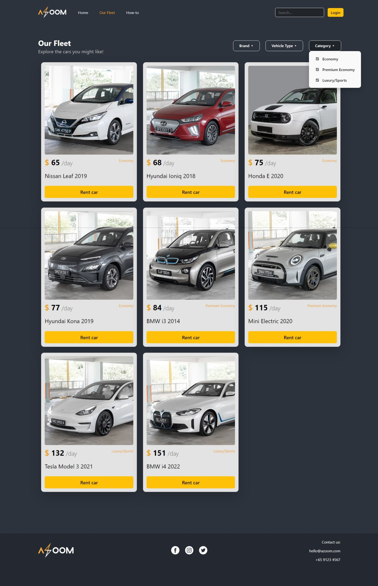
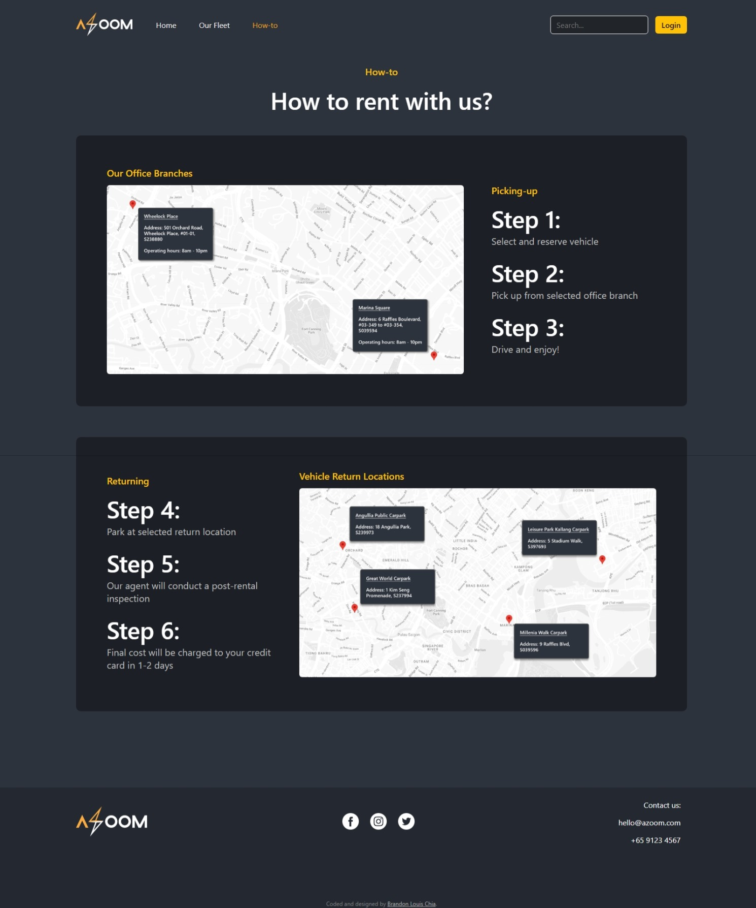
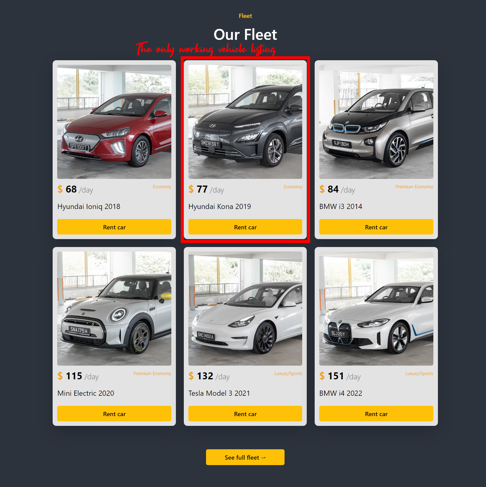
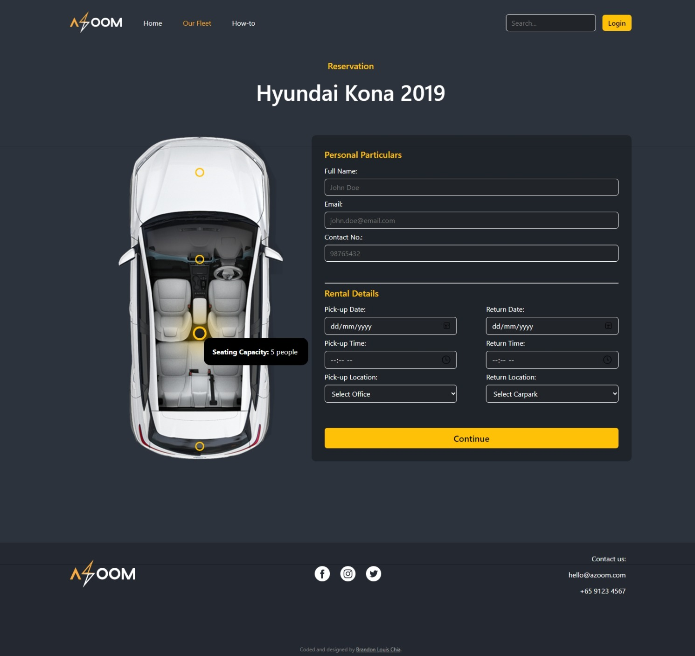
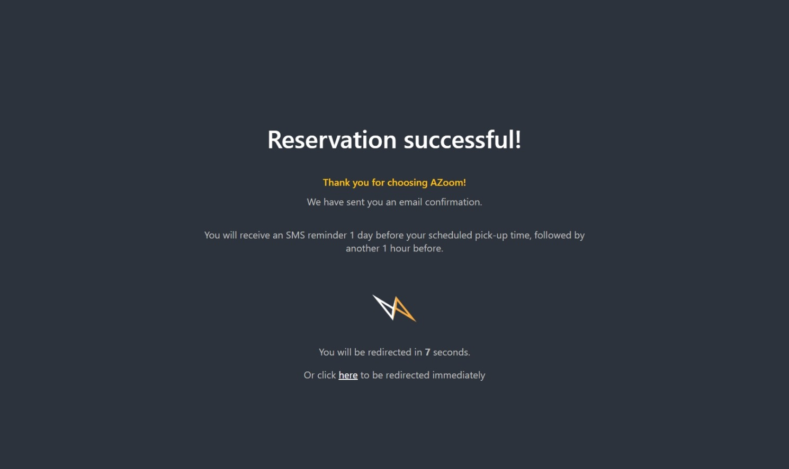
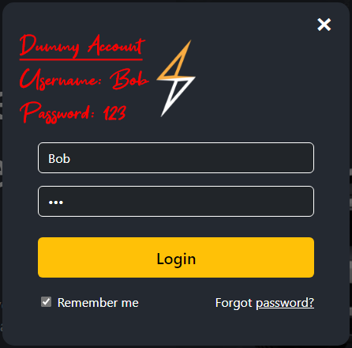
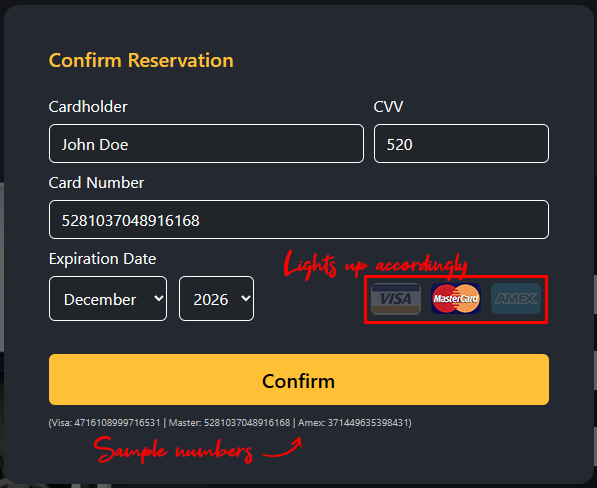

# Car Rental Webpage (HTML, CSS, JavaScript)
 
A simple website for car rentals that emphasizes UI/UX design.

## Table of contents

- [Overview](#overview)
  - [Screenshot](#screenshot)
  - [Links](#links)
- [My process](#my-process)
  - [Built with](#built-with)
  - [Continued development](#continued-development)
  - [What I learned](#what-i-learned)
  - [Useful resources](#useful-resources)
- [Author](#author)

## Overview

### The challenge

[Specifications.pdf](./Specifications.pdf)

### Screenshot

### Links

- Live Site URL: https://blc7896530-azoom.netlify.app/index.html

## My process

### Built with

- Semantic HTML5 markup
- CSS custom properties
- JavaScript
- Adobe Photoshop

### What I learned

Without using any external libraries or frameworks, I was forced to push the limits of creativity while working purely with HTML, CSS, and JavaScript. I wanted to create a visually stunning webpage that could compete with those powered by external libraries and frameworks. I methodically planned every aspect of the website's design, including the creation of the company logo.

### Continued development

I would have preferred to finish the search and filter functions, as well as have each vehicle listing have its own reservation page, given that the project's scope was purely frontend with basic functions.

### Useful resources

- [SGCarMart](https://www.sgcarmart.com/main/index.php) - Images for every car listing has been acquired from the "New Cars" section of SGCarMart.

## Author

- GitHub - https://github.com/brandonlouis
- LinkedIn - [Brandon Louis Chia](www.linkedin.com/in/brandon-louis-chia-63730b162)