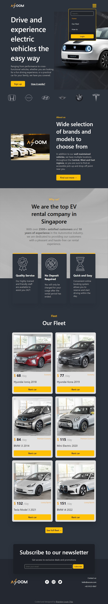
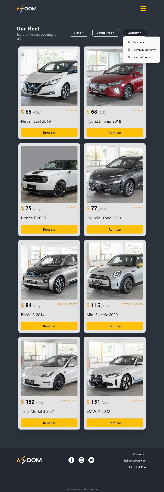
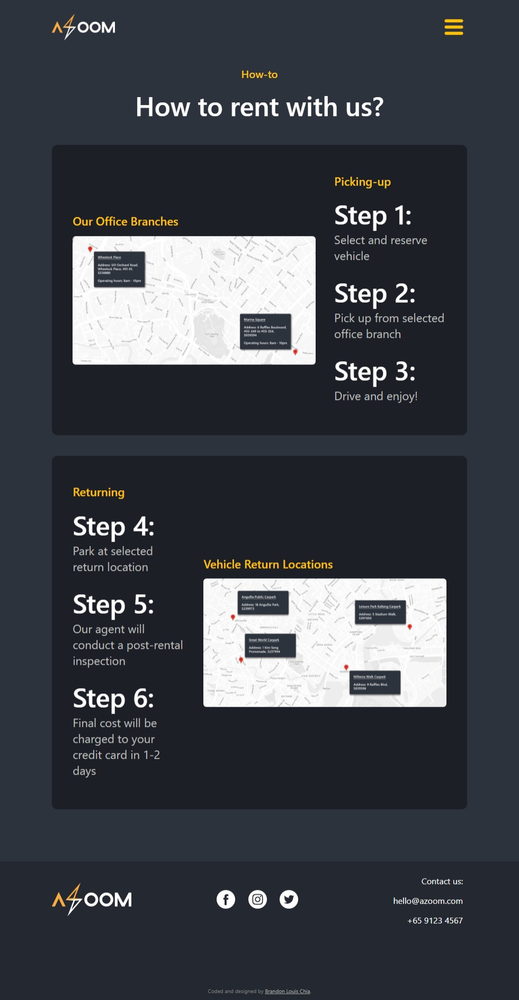
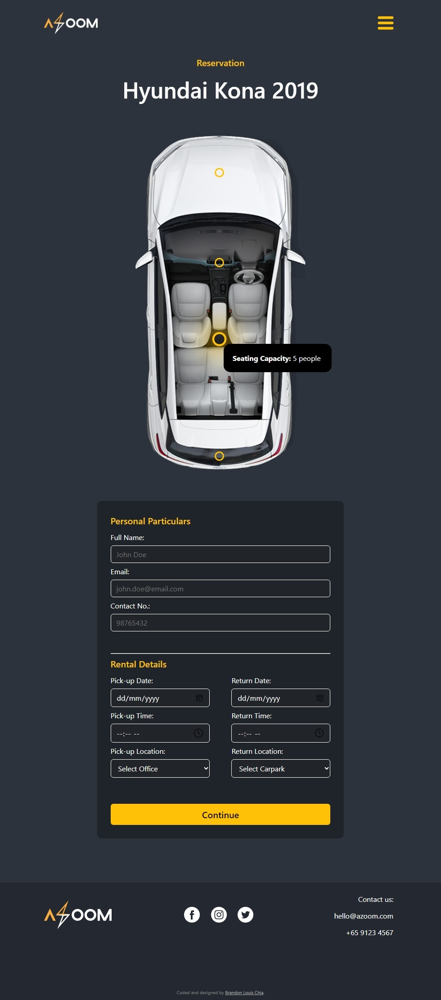
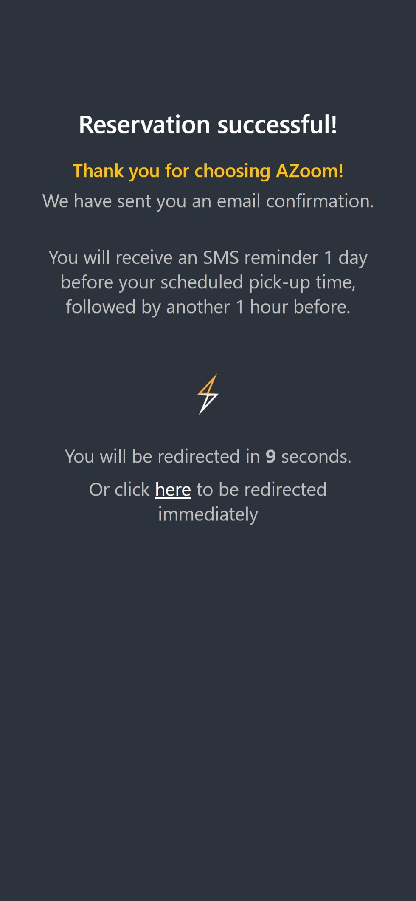

# Car Rental Webpage (HTML, CSS, JavaScript)
 
A simple responsive website for car rentals that emphasizes UI/UX design.

## Table of contents

- [Overview](#overview)
  - [Screenshots](#screenshots)
    - [Desktop](#desktop)
    - [Mobile](#mobile)
  - [Links](#links)
- [My process](#my-process)
  - [Built with](#built-with)
  - [Useful resources](#useful-resources)
- [Author](#author)

## Overview

### The challenge
No frameworks/libraries. Only plain HTML, CSS and JavaScript 
[Specifications.pdf](./Specifications.pdf)

### Screenshots

#### Desktop

#### Mobile

### Links

- Live Site URL: https://blc7896530-azoom.netlify.app/index.html

## My process

### Built with

- Semantic HTML5 markup
- CSS custom properties
- JavaScript
- Adobe Photoshop

### Useful resources

- [SGCarMart](https://www.sgcarmart.com/main/index.php) - Images for every car listing has been acquired from the "New Cars" section of SGCarMart.

## Author

- GitHub - https://github.com/brandonlouis
- LinkedIn - [Brandon Louis Chia](www.linkedin.com/in/brandon-louis-chia-63730b162)
