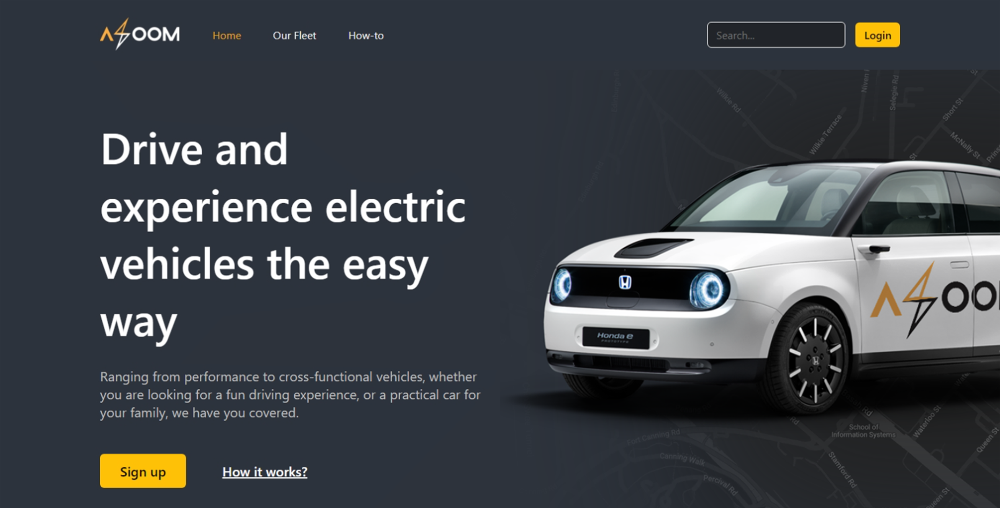
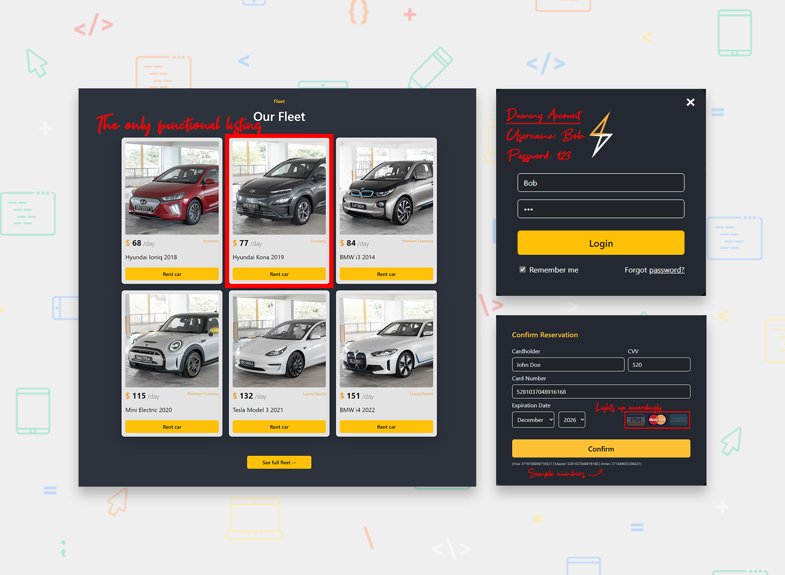

<h1 align="center">Car Rental Website (HTML, CSS, JavaScript)</h1>

[Live Site](https://blc7896530-azoom.netlify.app/index.html) | [Specifications](./Specifications.pdf)

A responsive car rental website that emphasizes UI/UX design.

## The challenge
No frameworks/libraries allowed. Only plain HTML, CSS and JavaScript 

## Screenshots

## Built with

- Semantic HTML5 markup
- CSS custom properties
- JavaScript
- Adobe Photoshop

## Useful resources

- [SGCarMart](https://www.sgcarmart.com/main/index.php) - Images for every car listing has been acquired from the "New Cars" section of SGCarMart.

## Author

- GitHub - https://github.com/brandonlouis
- LinkedIn - [Brandon Louis Chia](www.linkedin.com/in/brandon-louis-chia-63730b162)
